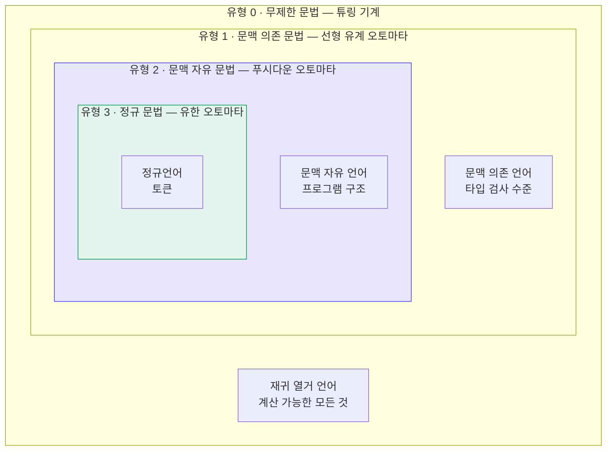
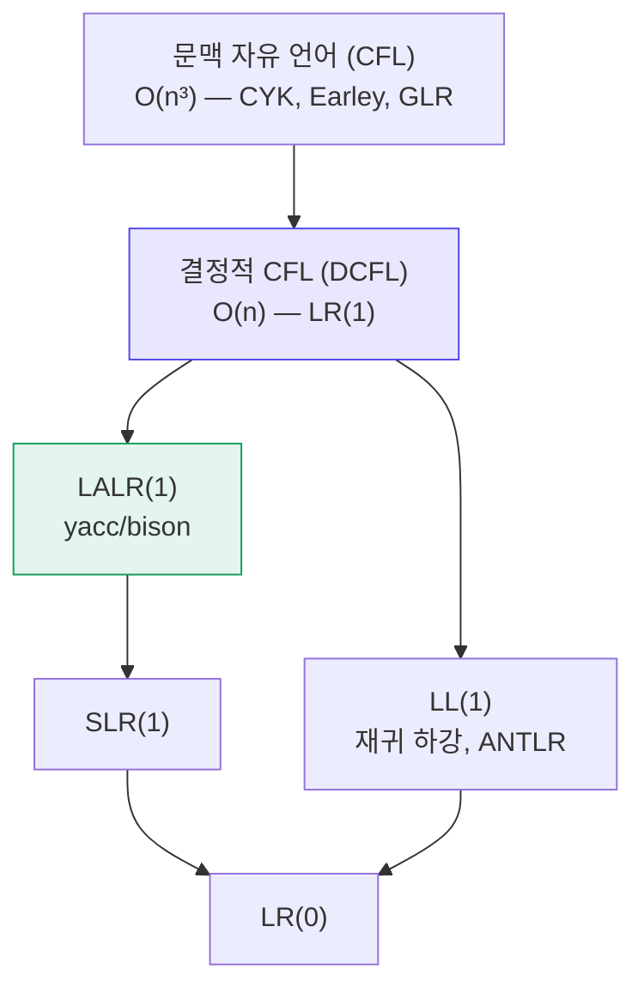

# 11. 문법의 유형

지금까지 두 종류의 문법을 보았다.

- [정규 문법](/docs/regular/regular-languages#32-정규-문법) — 우변에 넌터미널이 한쪽 끝에 최대 하나
- [문맥 자유 문법](/docs/parsing/context-free-grammar) — 좌변이 넌터미널 하나

두 문법의 관계는 **생성 규칙에 건 제약의 강도** 차이였다.
이 관점을 끝까지 밀고 가면 **촘스키 계층(Chomsky hierarchy)** 이 나온다.

Noam Chomsky가 1956년에 제시한 이 분류는
형식 언어 이론 전체의 지도이자, 컴파일러가 왜 지금의 모습인지에 대한 설명이다.

---

## 11.1 계층 전체

포함 관계는 **진부분집합**이다.

$$
\text{정규} \subsetneq \text{문맥 자유} \subsetneq \text{문맥 의존} \subsetneq \text{재귀 열거}
$$

각 단계마다 "이 단계에는 있지만 아래 단계에는 없는" 언어가 존재한다.

| 분리 증거 | 언어 |
|---|---|
| 정규 $\subsetneq$ CF | $\{a^n b^n\}$ |
| CF $\subsetneq$ CS | $\{a^n b^n c^n\}$ |
| CS $\subsetneq$ RE | 정지 문제(halting problem)에 대응하는 언어 |

---

## 11.2 네 유형의 정의

모두 $G = (V_N, V_T, P, S)$ 이고, 차이는 **생성 규칙 $\alpha \to \beta$ 의 형태**뿐이다.

### 유형 0 — 무제한 문법 (Unrestricted Grammar)

$$
\alpha \to \beta \qquad (\alpha \in V^+ \text{ 에 넌터미널이 하나 이상},\ \beta \in V^*)
$$

제약이 사실상 없다. 좌변이 우변보다 길어도 된다(**축약 규칙**).

- 대응 기계: **튜링 기계**
- 생성하는 언어: **재귀 열거 언어(recursively enumerable)**
- 소속 판정: **결정 불가능**. 준결정(semi-decidable)만 가능 —
  $w \in L$ 이면 언젠가 "예"라고 답하지만, $w \notin L$ 이면 영원히 돌 수 있다

### 유형 1 — 문맥 의존 문법 (Context-Sensitive Grammar)

$$
\alpha A \beta \to \alpha \gamma \beta \qquad (\gamma \neq \varepsilon)
$$

동등한 정의: $|\alpha| \leq |\beta|$ 인 모든 규칙 $\alpha \to \beta$.
즉 **유도할수록 문장이 짧아지지 않는다**(비축약, non-contracting).

- 대응 기계: **선형 유계 오토마타(LBA)** — 테이프 길이가 입력 길이에 비례하는 튜링 기계
- 소속 판정: **결정 가능**. 다만 PSPACE-완전이라 실용적이지 않다

**예제** — $\{a^n b^n c^n \mid n \geq 1\}$

$$
\begin{aligned}
S &\to a\,S\,B\,C \mid a\,B\,C \\
C\,B &\to B\,C \qquad &&\text{순서를 바로잡는 규칙} \\
a\,B &\to a\,b \\
b\,B &\to b\,b \\
b\,C &\to b\,c \\
c\,C &\to c\,c
\end{aligned}
$$

$CB \to BC$ 를 보자. 좌변이 심볼 **둘**이다. CFG가 아니다.
그리고 $aB \to ab$ 는 "$B$ 앞에 $a$ 가 있을 때만" 적용된다 —
**문맥에 의존**한다.

### 유형 2 — 문맥 자유 문법

$$
A \to \alpha \qquad (A \in V_N)
$$

- 대응 기계: **푸시다운 오토마타**
- 소속 판정: **결정 가능**, $O(n^3)$ (CYK, Earley).
  결정적 부분집합(DCFL)은 $O(n)$

### 유형 3 — 정규 문법

$$
A \to aB \mid a \mid \varepsilon \qquad \text{(우선형)}
$$

- 대응 기계: **유한 오토마타**
- 소속 판정: **결정 가능**, $O(n)$, 상수 공간

---

## 11.3 한눈에 보는 비교표

| | 유형 3 정규 | 유형 2 문맥 자유 | 유형 1 문맥 의존 | 유형 0 무제한 |
|---|---|---|---|---|
| **규칙 형태** | $A \to aB \mid a$ | $A \to \alpha$ | $\alpha A\beta \to \alpha\gamma\beta$ | $\alpha \to \beta$ |
| **기계** | 유한 오토마타 | 푸시다운 오토마타 | 선형 유계 오토마타 | 튜링 기계 |
| **기억 장치** | 없음 (상태만) | 스택 1개 | 유계 테이프 | 무한 테이프 |
| **소속 판정** | $O(n)$ | $O(n^3)$ | PSPACE-완전 | 결정 불가능 |
| **폐포: 합집합** | ✅ | ✅ | ✅ | ✅ |
| **폐포: 교집합** | ✅ | ❌ | ✅ | ✅ |
| **폐포: 여집합** | ✅ | ❌ | ✅ | ❌ |
| **공허성 판정** | ✅ | ✅ | ❌ | ❌ |
| **동등성 판정** | ✅ | ❌ | ❌ | ❌ |
| **컴파일러에서** | 어휘 분석 | 구문 분석 | (의미 분석) | — |

:::caution[CFL은 교집합과 여집합에 닫혀 있지 않다]
정규언어와 크게 다른 점이다.

$L_1 = \{a^n b^n c^m\}$ 과 $L_2 = \{a^m b^n c^n\}$ 은 각각 CFL이지만

$$
L_1 \cap L_2 = \{a^n b^n c^n\}
$$

은 CFL이 아니다.

실무적 함의: **두 문법을 교집합해서 언어를 정의할 수 없다.**
"식별자이면서 예약어가 아닌 것" 같은 규칙을 정규언어에서는
차집합으로 표현할 수 있었지만([3장 폐포 성질](/docs/regular/regular-languages#33-정규언어의-폐포-성질)),
CFG에서는 그런 방법이 없다.
:::

:::caution[CFG의 동등성 판정은 결정 불가능하다]
"이 두 문법이 같은 언어를 생성하는가?"에 답하는 알고리즘은 **존재하지 않는다**.
"이 문법이 모호한가?"도 마찬가지다
([2장](/docs/foundations/language-and-grammar#24-모호성)에서 언급했다).

이것이 yacc가 "당신의 문법은 모호합니다"라고 말해 주지 못하고
대신 "shift/reduce 충돌 3개"라는 간접 신호만 주는 이유다.
:::

---

## 11.4 컴파일러 각 단계와의 대응

계층은 추상적인 분류가 아니라 **컴파일러 설계의 청사진**이다.

| 검사할 것 | 필요한 계층 | 담당 |
|---|---|---|
| `123abc` 는 올바른 토큰인가 | 유형 3 | 어휘 분석기 |
| 괄호가 짝이 맞는가 | 유형 2 | 파서 |
| `if` 뒤에 조건식이 오는가 | 유형 2 | 파서 |
| 변수가 선언되었는가 | 유형 1 이상 | **의미 분석** |
| 타입이 맞는가 | 유형 1 이상 | **의미 분석** |
| 함수 인자 개수가 맞는가 | 유형 1 이상 | **의미 분석** |
| 프로그램이 종료하는가 | 유형 0 (결정 불가능) | — |

:::danger[핵심 원리]
> **각 단계에 딱 필요한 만큼의 표현력을 배정하고,
> 그 이상은 다음 단계로 미룬다.**

어휘 분석에 CFG를 쓰면 느려진다.
구문 분석에서 타입 검사를 하려 들면 문법이 폭발한다.
계층을 지키는 것이 곧 좋은 설계다.

3부에서 본 lex의 `depth` 카운터, 그리고 C의 "lexer hack"은
이 원칙을 어긴 사례들이고, 그래서 다루기 까다롭다.
:::

### 실제 언어가 계층을 벗어나는 지점

| 언어 | 벗어나는 지점 |
|---|---|
| C | `T * x;` — 타입 이름인지 변수인지 (lexer hack) |
| C++ | 템플릿 `a < b > c` — 파싱에 의미 정보가 필요 |
| Python | INDENT/DEDENT — 스캐너에 스택 필요 |
| Perl | 실행 시점에 문법이 바뀔 수 있다 |
| Rust, Swift | 중첩 주석 — 스캐너에 카운터 필요 |

:::note[Perl의 유명한 결론]
"Perl은 파싱할 수 없다(Perl cannot be parsed)"는 말이 있다.
Perl 프로그램을 파싱하려면 임의의 Perl 코드를 실행해야 할 수 있고,
따라서 정지 문제로 환원된다 — **유형 0**이다.

언어 설계에서 문법을 계층 안에 유지하는 것이 왜 중요한지 보여 주는 반례다.
:::

---

## 11.5 계층 사이의 실용적 세부 구분

컴파일러 실무에서 정말 중요한 것은 유형 2 **안쪽**의 세부 구분이다.

| 부류 | 인식 능력 | 도구 |
|---|---|---|
| LR(0) | 가장 약함 | (교육용) |
| SLR(1) | LR(0) ⊂ SLR(1) | (교육용) |
| **LALR(1)** | SLR(1) ⊂ LALR(1) | **yacc, bison** |
| LR(1) = DCFL | LALR(1) ⊂ LR(1) | menhir, LRSTAR |
| LL(1) | LR(1)에 진포함 | 재귀 하강 |
| LL(k), ALL(*) | LL(1) ⊂ LL(k) ⊂ ALL(*) | **ANTLR 4** |
| CFL 전체 | 가장 강함 | GLR (bison `%glr-parser`), tree-sitter, Earley |

중요한 사실 두 가지:

**① LL(1) ⊊ LR(1)**
모든 LL(1) 문법은 LR(1)이지만 역은 아니다.
LR이 더 많은 문법을 받는다. **좌재귀**가 대표적인 차이다.

**② LALR(1)은 LR(1)보다 약하다**
LALR은 LR(1) 상태를 병합해 표 크기를 줄인 것이다.
그 대가로 원래 없던 **reduce/reduce 충돌**이 생길 수 있다.
[14장](/docs/parsing/lr-parsing)에서 실제 예를 본다.

:::tip[왜 LALR(1)이 사실상의 표준이 되었나]
1965년 Knuth가 LR(1)을 발표했을 때, 실제 언어의 LR(1) 표는
당시 컴퓨터 메모리로 감당할 수 없을 만큼 컸다.

DeRemer가 1969년에 제안한 LALR(1)은 표를 **LR(0) 크기**로 유지하면서
실제 프로그래밍 언어 대부분을 감당한다.
1975년 yacc가 이를 채택하면서 사실상의 표준이 되었다.

메모리가 넘쳐나는 지금은 완전한 LR(1)을 써도 되고,
실제로 menhir 같은 도구가 그렇게 한다.
그럼에도 LALR(1)이 널리 쓰이는 이유는 순전히 **관성과 생태계**다.
:::

---

## 요약

- **촘스키 계층**은 생성 규칙에 건 제약의 강도로 문법을 넷으로 나눈다.
  $\text{정규} \subsetneq \text{CF} \subsetneq \text{CS} \subsetneq \text{RE}$
- 각 유형에 대응하는 기계는
  유한 오토마타 → PDA(스택 1개) → LBA(유계 테이프) → 튜링 기계.
  **늘어나는 것은 기억 장치의 힘**이다.
- CFL은 **교집합·여집합에 닫혀 있지 않고**, **동등성·모호성 판정이 불가능**하다.
  정규언어와 결정적으로 다른 점이며, yacc의 오류 보고 방식이 이 때문이다.
- 컴파일러의 단계 분리는 계층의 직접적 반영이다.
  **어휘 = 유형 3, 구문 = 유형 2, 의미 = 유형 1 이상.**
- 실무에서 정말 중요한 것은 유형 2 안쪽의 세부 구분이다.
  $\text{LR(0)} \subset \text{SLR(1)} \subset \text{LALR(1)} \subset \text{LR(1)} = \text{DCFL} \subset \text{CFL}$
- **LL(1) ⊊ LR(1)** — LR이 더 많은 문법을 받는다. 좌재귀가 대표적 차이다.
- **LALR(1)** 은 LR(1) 상태를 병합해 표를 줄인 것.
  yacc/bison의 기본이며, 그 대가로 reduce/reduce 충돌이 생길 수 있다.

## 확인 문제

1. 다음 문법은 몇 유형인가? 가장 제한적인(숫자가 큰) 유형으로 답하라.
   - (a) $S \to aSb \mid \varepsilon$
   - (b) $S \to aA$, $A \to bA \mid b$
   - (c) $aS \to Sa$, $S \to b$
   - (d) $S \to aSBC \mid abc$, $CB \to BC$, $bB \to bb$
2. CFL이 교집합에 닫혀 있지 않음을 $\{a^nb^nc^m\}$ 과 $\{a^mb^nc^n\}$ 으로 보여라.
3. "이 문법이 모호한가?"가 결정 불가능하다는 사실이
   yacc의 사용성에 어떤 영향을 주는가?
4. Python의 INDENT/DEDENT 처리가 왜 유형 3을 벗어나는지 설명하고,
   실제 구현이 어떻게 우회하는지 조사하라.
5. LL(1)이지만 LR(1)이 아닌 문법이 존재하는가? 근거를 대라.
6. LALR(1)이 LR(1)보다 약한데도 널리 쓰이는 역사적·실용적 이유를 정리하라.

---

계층의 지도를 얻었으니, 이제 유형 2 안에서
**실제로 파스 트리를 만드는 알고리즘**으로 들어간다.
