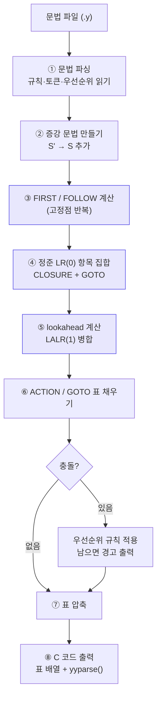
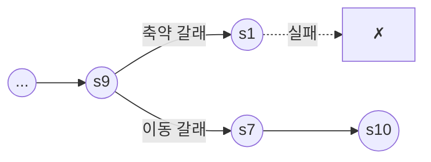

# 15. LR 파서의 구현

[14장](/docs/parsing/lr-parsing)에서 SLR(1) 표를 만들었다.
이 장에서는 그 표를 **실제로 돌아가는 C 프로그램**으로 만든다.

놀라운 점은 **구동 루프가 아주 짧다**는 것이다.
표만 있으면 파서 본체는 20줄 남짓이다.
그래서 파서 생성기가 하는 일의 99%는 "표 만들기"다.

---

## 15.1 구동 알고리즘

:::info[LR 파싱 알고리즘]
```
스택 ← [0]                 상태 0 만 있는 상태로 시작
입력 ← 토큰들 + $

반복:
    s ← 스택 맨 위 상태
    a ← 현재 입력 토큰

    ACTION[s, a] 가
      shift t   →  a 와 t 를 스택에 밀어 넣고, 입력을 하나 전진
      reduce (A → β)
                →  스택에서 |β| 쌍을 걷어 낸다
                   t ← 걷어 낸 뒤 스택 맨 위 상태
                   A 와 GOTO[t, A] 를 스택에 밀어 넣는다
                   (A → β 를 출력한다)
      accept    →  성공하고 종료
      error     →  오류 처리
```
:::

핵심은 **"$|\beta|$ 쌍을 걷어 낸다"** 이다.
스택에는 심볼과 상태가 번갈아 쌓이므로,
우변 길이가 3이면 심볼 3개와 상태 3개, 총 6칸을 걷어 낸다.

### C 구현

```c title="examples/06-lr-table-driven/lrparse.c (발췌)"
static int parse(long *result)
{
    sp = 0;
    state_stack[0] = 0;

    for (;;) {
        int s = state_stack[sp];
        int act = ACTION[s][tok];

        if (act == ACC) {                       /* 수락 */
            *result = val_stack[sp];
            return 1;
        }

        if (act == ERR) {                       /* 오류 */
            report_error(s);
            return 0;
        }

        if (act > 0) {                          /* 이동 */
            sp++;
            state_stack[sp] = act;
            val_stack[sp]   = tok_val;
            advance();
            continue;
        }

        /* 축약 */
        int p = -act;
        long v = semantic_action(p);            /* 값 계산 — 걷어 내기 전에! */
        sp -= PROD[p].rhslen;
        int go = GOTO[state_stack[sp]][PROD[p].lhs];
        sp++;
        state_stack[sp] = go;
        val_stack[sp]   = v;
    }
}
```

**이것이 전부다.** yacc가 생성하는 `yyparse()` 도
오류 복구와 표 압축 해제를 빼면 이 구조 그대로다.

:::tip[표 인코딩 관례]
액션 하나를 정수 하나에 담는 흔한 방법이다.

| 값 | 의미 |
|---|---|
| 양수 $n$ | shift, 상태 $n$ 으로 |
| 음수 $-n$ | reduce, 규칙 $n$ 으로 |
| 0 | 오류 |
| 특별한 값 | accept |

규칙 0(증강 규칙)은 축약에 쓰이지 않으므로
0을 오류 표시로 쓸 수 있다.
:::

---

## 15.2 표를 C 배열로

14장의 표를 그대로 옮긴 것이다.

```c title="examples/06-lr-table-driven/lrparse.c (발췌)"
#define ERR   0
#define ACC   999
#define SH(n) (n)
#define RE(n) (-(n))

/*                     num    +      *      (      )      $     */
static const int ACTION[NSTATES][NTERMINALS] = {
/*  0 */ { SH(5),  ERR,   ERR,   SH(4),  ERR,   ERR   },
/*  1 */ { ERR,    SH(6), ERR,   ERR,    ERR,   ACC   },
/*  2 */ { ERR,    RE(2), SH(7), ERR,    RE(2), RE(2) },
/*  3 */ { ERR,    RE(4), RE(4), ERR,    RE(4), RE(4) },
/*  4 */ { SH(5),  ERR,   ERR,   SH(4),  ERR,   ERR   },
/*  5 */ { ERR,    RE(6), RE(6), ERR,    RE(6), RE(6) },
/*  6 */ { SH(5),  ERR,   ERR,   SH(4),  ERR,   ERR   },
/*  7 */ { SH(5),  ERR,   ERR,   SH(4),  ERR,   ERR   },
/*  8 */ { ERR,    SH(6), ERR,   ERR,    SH(11),ERR   },
/*  9 */ { ERR,    RE(1), SH(7), ERR,    RE(1), RE(1) },
/* 10 */ { ERR,    RE(3), RE(3), ERR,    RE(3), RE(3) },
/* 11 */ { ERR,    RE(5), RE(5), ERR,    RE(5), RE(5) },
};

/*                       E    T    F  */
static const int GOTO[NSTATES][NNONTERMINALS] = {
/*  0 */ {  1,   2,   3 },
/*  4 */ {  8,   2,   3 },
/*  6 */ {  0,   9,   3 },
/*  7 */ {  0,   0,  10 },
    /* 나머지 행은 전부 0 */
};
```

[14장의 표](/docs/parsing/lr-parsing#완성된-표)와 나란히 놓고 대조해 보자.
한 칸도 다르지 않다.

---

## 15.3 의미 값 스택

파서는 구조만 확인하는 것이 아니라 **값을 만든다**.
그러려면 상태 스택과 나란히 **값 스택**이 필요하다.

```c
static int  state_stack[MAXSTACK];   /* 상태 */
static long val_stack[MAXSTACK];     /* 의미 값 */
```

축약할 때 우변의 값들로부터 좌변의 값을 계산한다.

```c
long v = 0;
switch (p) {
case 1: v = val_stack[sp - 2] + val_stack[sp]; break;  /* E → E + T */
case 3: v = val_stack[sp - 2] * val_stack[sp]; break;  /* T → T * F */
case 5: v = val_stack[sp - 1];                 break;  /* F → ( E ) */
default: v = val_stack[sp];                    break;  /* 단일 생성 규칙 */
}
sp -= PROD[p].rhslen;
```

:::danger[값을 읽는 것은 걷어 내기 *전*이다]
`sp -= rhslen` 을 먼저 하면 값들이 스택 밖으로 나가 버린다.
**반드시 값을 먼저 계산하고 그 다음에 걷어 낸다.**
:::

### yacc의 `$$`, `$1`, `$2` 의 정체

$E \to E + T$ 를 축약할 때 스택 맨 위 3칸이 $E$, `+`, $T$ 다.

| yacc 표기 | 이 코드에서 |
|---|---|
| `$1` (첫째 심볼 $E$) | `val_stack[sp - 2]` |
| `$2` (둘째 심볼 `+`) | `val_stack[sp - 1]` |
| `$3` (셋째 심볼 $T$) | `val_stack[sp]` |
| `$$` (결과) | 축약 후 밀어 넣을 값 |

즉 yacc의 액션

```c
expr : expr '+' term    { $$ = $1 + $3; }
```

은 정확히

```c
v = val_stack[sp - 2] + val_stack[sp];
```

로 번역된다. `$n` 은 **값 스택의 인덱스**일 뿐이다.

일반화하면, 우변 길이가 $k$ 일 때

`$n` ↔ `val_stack[sp - (k - n)]`

:::caution[`$0` 과 음수 인덱스]
yacc는 `$0`, `$-1` 도 허용한다. **우변이 시작되기 전의 스택**을 가리킨다.
가끔 유용하지만 매우 위험하다 — 그 위치에 무엇이 있는지는
어느 문맥에서 축약되는지에 달렸기 때문에, 문법이 바뀌면 조용히 깨진다.
:::

### 타입이 여럿일 때

실제로는 값이 정수만은 아니다. 정수, 실수, 문자열, AST 노드 포인터가 섞인다.
**공용체(union)** 를 쓴다.

```c
typedef union {
    long   num;
    char  *str;
    Node  *node;
} Value;

static Value val_stack[MAXSTACK];
```

yacc에서는 `%union` 선언이 이 공용체를 만들어 주고,
`%type`/`%token` 선언이 어느 심볼이 어느 멤버를 쓰는지 알려 준다.
그러면 `$1` 이 `val_stack[...].node` 로 정확히 번역된다.

**타입 선언을 빼먹으면** yacc가 잘못된 멤버를 읽어
아무 경고 없이 쓰레기 값이 나온다. 흔한 버그다.

---

## 15.4 직접 실행해 보기

```bash
cd examples/06-lr-table-driven
make && make test
echo "2 + 3 * 4" | ./lrparse -t
```

```
식: 2 + 3 * 4
   # | stack                        | input          | action
   1 | 0                            | 2 + 3 * 4 $    | 이동 s5
   2 | 0 num 5                      | + 3 * 4 $      | 축약 r6 : F  -> num
   3 | 0 F 3                        | + 3 * 4 $      | 축약 r4 : T  -> F
   4 | 0 T 2                        | + 3 * 4 $      | 축약 r2 : E  -> T
   5 | 0 E 1                        | + 3 * 4 $      | 이동 s6
   6 | 0 E 1 + 6                    | 3 * 4 $        | 이동 s5
   7 | 0 E 1 + 6 num 5              | * 4 $          | 축약 r6 : F  -> num
   8 | 0 E 1 + 6 F 3                | * 4 $          | 축약 r4 : T  -> F
   9 | 0 E 1 + 6 T 9                | * 4 $          | 이동 s7
  10 | 0 E 1 + 6 T 9 * 7            | 4 $            | 이동 s5
  11 | 0 E 1 + 6 T 9 * 7 num 5      | $              | 축약 r6 : F  -> num
  12 | 0 E 1 + 6 T 9 * 7 F 10       | $              | 축약 r3 : T  -> T * F
  13 | 0 E 1 + 6 T 9                | $              | 축약 r1 : E  -> E + T
  14 | 0 E 1                        | $              | 수락
  값: 14
  축약을 역순으로 읽으면 우측 유도: r1 -> r3 -> r6 -> r4 -> r6 -> r2 -> r4 -> r6
```

:::tip[9번 행이 이 장 전체의 요점이다]
```
   9 | 0 E 1 + 6 T 9                | * 4 $          | 이동 s7
```

스택이 `E + T` 이고 입력이 `*` 다.
$E \to E + T$ 로 **축약할 수도** 있었지만 표가 **이동**을 지시한다.

$\mathrm{ACTION}[9, *] = s7$ 이기 때문이고,
그 칸이 그렇게 채워진 이유는 상태 9의 항목 집합
$\{E \to E+T\cdot,\ T \to T\cdot *F\}$ 에서
`*` 가 $\mathrm{FOLLOW}(E)$ 에 없기 때문이다.

**문법을 $E/T/F$ 로 계층화한 것이, 표의 한 칸으로, 그리고
"곱셈이 먼저"라는 실행 결과로 이어진다.**
14장의 이론과 이 실행 로그는 같은 것의 두 모습이다.
:::

---

## 15.5 오류 처리

### 오류 검출

$\mathrm{ACTION}[s, a]$ 가 비어 있으면 오류다.
**LR 파서는 오류를 가능한 가장 이른 시점에 검출한다** —
잘못된 토큰을 절대 이동하지 않는다는 성질이 있다.

### 기대 토큰 목록 얻기

표에서 공짜로 얻을 수 있다.

```c
/* 표의 그 행에서 ERR 이 아닌 열이 곧 "기대하는 토큰" 이다. */
char expect[128] = "";
for (int t = 0; t < NTERMINALS; t++) {
    if (ACTION[s][t] == ERR) continue;
    if (expect[0]) strncat(expect, ", ", ...);
    strncat(expect, TERM_NAME[t], ...);
}
printf("  오류 %d열 | 실제: %s | 기대: %s | 상태: %d\n",
       col, TERM_NAME[tok], expect, s);
```

```
$ ./lrparse < tests/errors.in
식: 2 +
  오류 4열 | 실제: $ | 기대: num, ( | 상태: 6
식: + 2
  오류 1열 | 실제: + | 기대: num, ( | 상태: 0
식: ( 2
  오류 4열 | 실제: $ | 기대: +, ) | 상태: 8
식: 2 )
  오류 3열 | 실제: ) | 기대: +, $ | 상태: 1
식: 2 2
  오류 3열 | 실제: num | 기대: +, *, ), $ | 상태: 5
```

bison의 `%define parse.error verbose` 가 만들어 주는
`syntax error, unexpected ')', expecting '+' or '*'` 가 바로 이것이다.

:::caution[기대 목록이 항상 유용하지는 않다]
표 압축(다음 절) 때문에 기대 목록이 부정확해질 수 있다.
`$default` 로 뭉뚱그린 축약이 있으면 "무엇이든 올 수 있다"처럼 보인다.

bison 3.8+ 의 `%define parse.error detailed` 는 이 문제를 개선했다.
:::

### 패닉 모드 복구

오류 후에도 파싱을 계속하려면, 스택을 **동기화 토큰을 받아들일 수 있는
상태가 나올 때까지** 걷어 낸다.

```
1. 스택을 위에서부터 걷어 내며, GOTO[s, error] 가 정의된 상태 s 를 찾는다
2. 그 상태로 가서, "error" 라는 가상 심볼을 이동한 것처럼 처리한다
3. 입력을 버리다가, 그 상태에서 받아들일 수 있는 토큰이 나오면 재개한다
```

yacc에서는 문법에 `error` 토큰을 써서 지정한다.

```c
stmt : expr ';'
     | error ';'    { yyerrok; }    /* ';' 까지 버리고 재개 */
     ;
```

[YACC 충돌과 우선순위](/docs/yacc/conflicts-and-precedence) 장에서 자세히 다룬다.

---

## 15.6 표 압축

실제 언어의 LR 표는 크다. C 문법이면 상태 수백 개 × 토큰 100여 개.
그대로 두면 수만 칸의 배열이 되는데, **대부분이 오류 칸**이다.

### 기법 ① 기본 축약 (default reduction)

한 행의 축약 액션이 모두 같으면, 열마다 반복하지 말고
"이 행의 기본값은 축약 $r_k$" 라고 한 번만 적는다.

위 표의 상태 3, 5, 10, 11이 그렇다.
`bison -v` 의 `.output` 에 나오는 `$default` 가 이것이다.

```
State 3

    4 T: F .

    $default  reduce using rule 4 (T)
```

:::caution[기본 축약은 오류 검출을 늦춘다]
잘못된 토큰이 와도 일단 축약을 몇 번 더 하고 나서야 오류를 발견한다.
**다만 잘못된 토큰을 이동하지는 않으므로** 최종 판정은 여전히 옳다.

성능(표 크기)과 진단 품질의 trade-off다.
:::

### 기법 ② 행 겹쳐 쓰기 (row displacement)

여러 행을 하나의 큰 1차원 배열에 **오프셋을 달리해 겹쳐** 넣는다.
행마다 실제 값이 있는 칸이 적으므로, 잘 배치하면 겹치지 않게 넣을 수 있다.

flex와 bison이 만드는 `yy_base`, `yy_check`, `yy_table` 배열이 이 방식이다.

```c
/* 개념적으로 */
action = (yy_check[yy_base[state] + token] == state)
       ? yy_table[yy_base[state] + token]
       : yy_default[state];
```

`yy_check` 로 "이 칸이 정말 이 행의 것인지"를 검증하는 것이 핵심이다.

:::tip[생성된 파일에서 직접 확인하기]
```bash
cd examples/07-yacc-calc
bison -d -o calc.tab.c calc.y
grep -n "yypact\|yytable\|yycheck\|yydefact" calc.tab.c | head
```
`yypact`(행 오프셋), `yytable`(값), `yycheck`(검증), `yydefact`(기본 축약)
네 배열이 보인다. 위 개념 그대로다.
:::

### 기법 ③ 직접 코딩

표 대신 `switch` 문으로 상태를 표현한다.
어휘 분석기의 [직접 코딩 방식](/docs/regular/finite-automata#방법-2--직접-코딩-direct-coded)과 같은 발상이다.
캐시 효율이 좋지만 코드가 커진다.

---

## 15.7 파서 생성기가 하는 일

지금까지의 내용을 종합하면, 파서 생성기의 파이프라인이 보인다.



강조된 ③④⑤가 4부에서 배운 내용이고, 생성기 작업의 대부분이다.
⑧에서 출력되는 `yyparse()` 는 15.1절의 20줄과 거의 같다.

:::tip[bison의 출력을 직접 확인하자]
```bash
bison -v -d calc.y
```
- `calc.output` — ④⑤⑥의 결과. 모든 상태의 항목 집합과 액션
- `calc.tab.c` — ⑦⑧의 결과. 압축된 표와 구동 루프
- `calc.tab.h` — 토큰 상수 (lex와 공유)

`calc.output` 의 `State 9` 를 찾아 보자.
14장에서 손으로 만든 $I_9$ 와 같다는 것을 확인할 수 있다.
:::

---

## 15.8 GLR — 충돌을 포기하지 않기

LALR(1)로 안 되는 문법을 만나면 어떻게 할까?
문법을 고치는 것이 정석이지만, 언어 명세가 정해져 있어 못 고칠 때가 있다.

**GLR(Generalized LR)** 은 충돌이 나면 **모든 가능성을 동시에 탐색**한다.

- 스택을 **그래프**로 만든다 (GSS, Graph-Structured Stack)
- 충돌 지점에서 스택이 갈라지고, 실패한 갈래는 사라진다
- 모호한 입력이면 여러 파스 트리가 나온다 (파스 포레스트)



- bison: `%glr-parser` 로 켠다
- 결정적인 부분에서는 LR과 같은 속도, 충돌 지점에서만 느려진다
- **tree-sitter**가 GLR을 쓴다. 실제 언어의 모호성을 다루고,
  오류가 있는 입력에도 ERROR 노드를 올바른 위치에 넣은
  유효한 구문 트리를 만들 수 있다 — 에디터에서 타이핑 중인 코드에 필수다

:::caution[GLR을 만능으로 쓰지 말 것]
충돌을 GLR로 덮으면, 문법의 진짜 모호성이 **런타임까지 미뤄진다**.
파스 포레스트 중 어느 것을 고를지 결국 사람이 정해야 한다.

먼저 문법을 고쳐 보고, 그래도 안 될 때 쓰는 도구다.
:::

---

## 15.9 LL과 LR을 나란히 놓고

같은 계산기를 두 방식으로 만들어 보았다.

```bash
cd examples/05-recursive-descent && make && echo "2 + 3 * 4" | ./calc
cd ../06-lr-table-driven      && make && echo "2 + 3 * 4" | ./lrparse
```

| | 05 재귀 하강 (LL) | 06 표 구동 (LR) |
|---|---|---|
| 문법 | 좌재귀 **제거 필요** | 좌재귀 **그대로** |
| 결합성 | 액션 코드에서 왼쪽으로 접음 | 문법이 알아서 |
| 코드 | 문법이 그대로 보인다 | 표를 봐야 안다 |
| 코드 길이 | 250줄 | 260줄 (표 포함) |
| 오류 메시지 | "factor를 파싱하는 중" | "기대: num, (" |
| 손으로 유지보수 | 쉽다 | 사실상 불가능 |
| 문법 변경 | 함수 고침 | **표 재생성 필요** |
| 처리 가능 문법 | LL(1) | LR(1) — 더 넓다 |

:::note[표를 손으로 유지할 수 없다는 것이 핵심이다]
06의 `ACTION` 표는 12×6 = 72칸이다.
문법에 규칙을 하나만 추가해도 상태가 늘어나고 표 전체를 다시 만들어야 한다.

C 문법이면 상태가 수백 개다. **손으로는 절대 못 한다.**
그래서 yacc가 필요하다.

반대로 05의 재귀 하강은 규칙 추가가 함수 하나 추가다.
프로덕션 컴파일러들이 손으로 쓴 재귀 하강을 쓰는 이유이기도 하다.
:::

---

## 요약

- LR 구동 알고리즘은 **20줄**이다. 생성기의 일은 거의 전부 **표 만들기**다.
- 액션 인코딩: 양수 = shift, 음수 = reduce, 0 = 오류.
- **의미 값 스택**이 상태 스택과 나란히 움직인다.
  yacc의 `$1`, `$2`, `$$` 는 **값 스택의 인덱스**일 뿐이다.
  `$n` ↔ `val_stack[sp - (k - n)]`
- 값은 **걷어 내기 전에** 계산해야 한다.
- 오류 시 **기대 토큰 목록**은 표의 그 행에서 그냥 읽으면 된다.
- **표 압축** — 기본 축약(`$default`), 행 겹쳐 쓰기(`yypact`/`yycheck`), 직접 코딩.
  기본 축약은 표를 줄이지만 **오류 검출을 늦춘다**
  (잘못된 토큰을 이동하지는 않으므로 판정은 여전히 옳다).
- 파서 생성기 파이프라인:
  문법 읽기 → 증강 → FIRST/FOLLOW → 정준 항목 집합 → LALR 병합
  → 표 채우기 → 충돌 해결 → 압축 → 코드 출력.
- **GLR** 은 충돌 지점에서 스택을 갈라 모든 가능성을 탐색한다.
  bison `%glr-parser`, tree-sitter가 쓴다.

## 확인 문제

1. $E \to E + T$ 를 축약할 때, 스택에서 정확히 몇 칸을 걷어 내는가?
   심볼과 상태를 따로 세어 보라.
2. `$$ = $1 + $3;` 을 값 스택 인덱스로 번역하라. 우변 길이가 5라면 `$2`는?
3. 값을 걷어 낸 **뒤에** 읽으면 어떤 일이 벌어지는지 구체적으로 설명하라.
4. `./lrparse -t` 로 `( 2 + 3 ) * 4` 를 돌리고,
   상태 4와 8이 언제 스택에 들어가고 나가는지 추적하라.
5. 기본 축약이 오류 검출을 늦추는 것을 `2 2` 입력으로 확인하라.
   압축이 없다면 몇 단계 빨리 오류를 발견했겠는가?
6. 05와 06을 모두 고쳐 나눗셈 `/` 를 추가하라.
   어느 쪽이 더 손이 많이 가는가? 왜인가?
7. `bison -v` 로 `.output` 을 뽑아 `yypact`, `yycheck` 배열이
   어떻게 쓰이는지 소스에서 확인하라.

---

4부가 끝났다.

이론은 전부 갖췄다. 정규 표현에서 DFA를, CFG에서 LR 표를 만들 수 있고,
그 표로 파서를 돌릴 수 있다.

5부에서는 이 모든 것을 **자동화한 도구**인 yacc로,
lex와 함께 하나의 컴파일러 프론트엔드를 완성한다.
