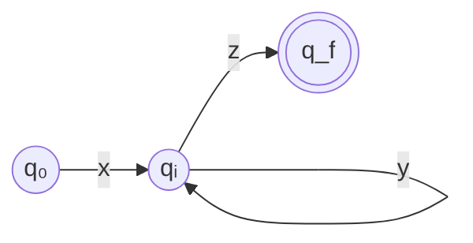

# 3. 정규언어

**정규언어(regular language)** 는 형식 언어 계층에서 가장 단순한 부류다.
단순하다는 것은 표현력이 약하다는 뜻이지만,
동시에 **아주 빠르고 작은 기계로 인식할 수 있다**는 뜻이기도 하다.

컴파일러의 어휘 분석기가 정규언어 위에서 돌아가는 이유가 정확히 이것이다.
식별자·숫자·연산자 같은 토큰은 정규언어로 충분히 기술되고,
그 대가로 우리는 입력 문자당 상수 시간이라는 성능을 얻는다.

---

## 3.1 정규집합의 정의

정규언어는 **귀납적으로** 정의된다.
"이것들은 정규다"라는 기본 규칙 몇 개와,
"정규인 것들을 이렇게 조합해도 정규다"라는 조립 규칙으로 이루어진다.

:::info[정의 — 알파벳 $\Sigma$ 위의 정규집합(regular set)]

**기본**

1. $\emptyset$ 은 정규집합이다.
2. $\{\varepsilon\}$ 은 정규집합이다.
3. 각 $a \in \Sigma$ 에 대해 $\{a\}$ 는 정규집합이다.

**귀납**

$R$ 과 $S$ 가 정규집합이면 다음도 정규집합이다.

4. $R \cup S$ (합집합)
5. $RS$ (접합)
6. $R^*$ (클레이니 클로저)

**폐쇄 조건**

위 규칙을 **유한 번** 적용해 만들 수 있는 것만이 정규집합이다.
:::

정규집합인 언어를 **정규언어**라 부른다. 둘은 같은 말로 쓴다.

### 왜 이 세 연산인가

합집합·접합·클로저는 각각 프로그래밍의 세 가지 기본 제어 구조에 대응한다.

| 연산 | 의미 | 대응 |
|---|---|---|
| $R \cup S$ | R이거나 S | **선택** (if / switch) |
| $RS$ | R 다음에 S | **순차** (문장 나열) |
| $R^*$ | R을 0번 이상 | **반복** (while) |

"선택·순차·반복만으로 만들 수 있는 패턴"이 곧 정규언어라고 생각해도 좋다.
빠져 있는 것은 **재귀**다. 재귀가 필요한 순간 정규언어를 벗어난다.

### 예제

$\Sigma = \{a, b\}$ 일 때 다음은 모두 정규언어다.

| 언어 | 구성 |
|---|---|
| $\{a, b\}$ | $\{a\} \cup \{b\}$ |
| $\{ab\}$ | $\{a\}\{b\}$ |
| 모든 스트링 $\Sigma^*$ | $(\{a\} \cup \{b\})^*$ |
| $a$로 시작하는 스트링 | $\{a\}\Sigma^*$ |
| $a$가 짝수 개인 스트링 | $(b^* a b^* a b^*)^* b^*$ 형태로 구성 가능 |
| 길이가 3의 배수인 스트링 | $(\Sigma\Sigma\Sigma)^*$ |

---

## 3.2 정규 문법

[2장](/docs/foundations/language-and-grammar)에서 정의한 문법
$G = (V_N, V_T, P, S)$ 에 **생성 규칙의 모양을 제한**하면 정규 문법이 된다.

:::info[정의 — 정규 문법(regular grammar)]

모든 생성 규칙이 다음 형태 중 하나이면 **우선형 문법(right-linear grammar)** 이다.

$$
A \to aB \qquad A \to a \qquad A \to \varepsilon
$$

($A, B \in V_N$, $a \in V_T$)

모든 생성 규칙이 다음 형태 중 하나이면 **좌선형 문법(left-linear grammar)** 이다.

$$
A \to Ba \qquad A \to a \qquad A \to \varepsilon
$$

둘 중 하나이면 **정규 문법**이라 하고, 두 부류는 같은 언어 집합을 생성한다.
:::

핵심 제약은 **우변에 넌터미널이 최대 하나, 그것도 맨 끝(또는 맨 앞)에만**
올 수 있다는 것이다. $A \to aBc$ 나 $A \to BC$ 는 정규 문법이 아니다.

:::caution[한 문법 안에서 좌·우선형을 섞으면 안 된다]
$S \to aB$ 와 $S \to Ba$ 를 함께 쓰면 정규 문법이 아니게 되고,
실제로 정규언어가 아닌 언어를 만들 수 있다. 예를 들어

$$
S \to aB \mid \varepsilon, \qquad B \to Sb
$$

는 규칙 하나하나는 선형 꼴이지만 섞여 있고,
$\{a^n b^n\}$ 을 생성한다 — 정규언어가 아니다.
:::

### 우선형 문법과 오토마타의 대응

우선형 문법은 유한 오토마타의 **글로 쓴 형태**다. 대응은 기계적이다.

$$
A \to aB \quad\Longleftrightarrow\quad \delta(A, a) = B
$$

$$
A \to a \quad\Longleftrightarrow\quad \delta(A, a) = F \ (F \text{는 종결 상태})
$$

$$
A \to \varepsilon \quad\Longleftrightarrow\quad A \text{ 가 종결 상태}
$$

**예제.** `a`로 시작해서 `b`로 끝나는 스트링의 문법:

$$
\begin{aligned}
S &\to aA \\
A &\to aA \mid bA \mid b
\end{aligned}
$$

이것을 상태 전이도로 옮기면 상태 3개짜리 오토마타가 나온다.
[다음 장](/docs/regular/finite-automata)에서 이 대응을 실제로 다룬다.

### 좌선형 문법의 예

$$
\begin{aligned}
S &\to Sa \mid Sb \mid A \\
A &\to a
\end{aligned}
$$

`a`로 **시작**하는 스트링이다. 좌선형에서는 스트링이 오른쪽 끝에서부터
자라 나가므로 직관이 반대로 뒤집힌다는 데 주의하자.

---

## 3.3 정규언어의 폐포 성질

정규언어 부류는 여러 연산에 대해 **닫혀 있다(closed)**.
즉 정규언어에 그 연산을 적용한 결과도 여전히 정규언어다.

| 연산 | 닫힘? | 근거 |
|---|---|---|
| 합집합 $L_1 \cup L_2$ | ✅ | 정의에 포함 |
| 접합 $L_1 L_2$ | ✅ | 정의에 포함 |
| 클로저 $L^*$ | ✅ | 정의에 포함 |
| 여집합 $\overline{L}$ | ✅ | DFA의 종결/비종결 상태를 뒤집는다 |
| 교집합 $L_1 \cap L_2$ | ✅ | 곱 구성(product construction) 또는 드모르간 |
| 차집합 $L_1 - L_2$ | ✅ | $L_1 \cap \overline{L_2}$ |
| 역 $L^R$ | ✅ | 간선 방향을 뒤집고 시작/종결을 교환 |
| 준동형사상 $h(L)$ | ✅ | 기호를 스트링으로 치환 |

### 여집합이 닫혀 있다는 것의 의미

DFA $M$ 이 $L$ 을 인식할 때, **종결 상태 집합을 그 여집합으로 바꾼**
DFA $M'$ 은 $\overline{L}$ 을 인식한다.

:::caution[이 논증은 DFA에서만 통한다]
NFA에서 종결 상태를 뒤집으면 여집합이 나오지 **않는다**.
NFA는 여러 경로를 동시에 탐색하므로,
"모든 경로가 거부"와 "어떤 경로가 수락되지 않음"이 다르기 때문이다.
반드시 DFA로 바꾼 뒤 뒤집어야 한다. 또한 DFA가 **완전(complete)** 해야 한다.
즉 모든 상태에서 모든 기호에 대한 전이가 정의되어 있어야 한다
(없으면 죽은 상태 trap state를 추가한다).
:::

### 교집합 — 곱 구성

$M_1 = (Q_1, \Sigma, \delta_1, q_1, F_1)$, $M_2 = (Q_2, \Sigma, \delta_2, q_2, F_2)$
두 DFA에 대해

$$
M = (Q_1 \times Q_2,\ \Sigma,\ \delta,\ (q_1, q_2),\ F_1 \times F_2)
$$

$$
\delta((p, q), a) = (\delta_1(p, a),\ \delta_2(q, a))
$$

두 오토마타를 **동시에 돌리고**, 둘 다 종결 상태일 때만 수락한다.
합집합이 필요하면 종결 집합을 $(F_1 \times Q_2) \cup (Q_1 \times F_2)$ 로 바꾸면 된다.

:::tip[실무에서 유용한 지점]
"식별자이면서 예약어가 아닌 것"은 차집합이다.
정규언어는 차집합에 닫혀 있으므로 이런 패턴도 원리적으로는 정규 표현으로 쓸 수 있다.
다만 표현이 폭발적으로 길어지므로, lex에서는
**규칙 순서(예약어 규칙을 먼저 쓴다)** 로 해결하는 것이 관례다.
[LEX 입력 및 파싱](/docs/lex/lex-input-and-parsing) 장에서 다시 다룬다.
:::

---

## 3.4 정규언어의 한계

정규언어로 표현할 수 **없는** 것이 무엇인지 아는 것이,
표현할 수 있는 것을 아는 것만큼 중요하다.
이것이 어휘 분석과 구문 분석을 나누는 이론적 근거이기 때문이다.

### 직관 — 유한 오토마타는 셀 수 없다

유한 오토마타에는 **유한한 개수의 상태**밖에 없다.
상태가 곧 기억의 전부다. 따라서

> 임의로 큰 수를 세어서 기억해 둘 수 없다.

$\{a^n b^n \mid n \geq 0\}$ 을 인식하려면 $a$ 를 몇 개 읽었는지 기억해야 하는데,
$n$ 에 상한이 없으므로 유한한 상태로는 불가능하다.

### 펌핑 보조정리

이 직관을 정확한 증명 도구로 만든 것이 **펌핑 보조정리(pumping lemma)** 다.

:::info[정리 — 정규언어의 펌핑 보조정리]

$L$ 이 정규언어이면, 어떤 상수 $p \geq 1$ (펌핑 길이)이 존재하여
$|w| \geq p$ 인 모든 $w \in L$ 을 $w = xyz$ 로 쪼갤 수 있고, 다음을 만족한다.

1. $|y| \geq 1$  (펌프할 부분이 비어 있지 않다)
2. $|xy| \leq p$  (펌프할 부분이 앞쪽 $p$ 글자 안에 있다)
3. 모든 $i \geq 0$ 에 대해 $xy^i z \in L$
:::

**왜 성립하는가.** $L$ 을 인식하는 DFA의 상태가 $p$ 개라고 하자.
길이 $p$ 이상인 스트링을 읽으면 상태를 $p+1$ 번 이상 방문하므로,
비둘기집 원리에 의해 **같은 상태를 두 번 지난다**.

:::note[비둘기집 원리 (pigeonhole principle)]
> 비둘기 $n+1$ 마리를 비둘기집 $n$ 개에 넣으면
> **적어도 한 집에는 두 마리 이상** 들어간다.

너무 당연해 보이지만, "반드시 겹치는 것이 있다"를 보장하는 강력한 도구다.

여기서는
- **비둘기** = 상태 방문 (길이 $p$ 스트링을 읽으면 $p+1$ 번 방문한다)
- **비둘기집** = 상태 ($p$ 개)

$p+1 > p$ 이므로 **어떤 상태는 반드시 두 번 방문된다.**
같은 상태를 두 번 지났다면 그 사이는 **고리**다.
:::



$q_i$ 를 두 번 지났다는 것은 그 사이 구간 $y$ 가 **고리(loop)** 라는 뜻이다.
고리는 몇 번을 돌아도(0번 포함) 같은 상태로 돌아오므로
$xy^0z, xy^1z, xy^2z, \dots$ 가 모두 수락된다.

### 증명 예제 ① — $\{a^n b^n\}$ 은 정규가 아니다

**귀류법.** $L = \{a^n b^n \mid n \geq 0\}$ 이 정규라고 가정하고
펌핑 길이를 $p$ 라 하자.

$w = a^p b^p$ 를 택한다. $|w| = 2p \geq p$ 이므로 보조정리를 적용할 수 있고,
$w = xyz$ 로 쪼개면 조건 2 $|xy| \leq p$ 에 의해
$x$ 와 $y$ 는 **앞쪽 $a$ 들 안에만** 있다. 즉

$$
x = a^s, \quad y = a^t \ (t \geq 1), \quad z = a^{p-s-t}b^p
$$

이제 $i = 2$ 로 펌프하면

$$
xy^2z = a^{s} a^{2t} a^{p-s-t} b^p = a^{p+t} b^p
$$

$t \geq 1$ 이므로 $a$ 의 개수가 $b$ 보다 많다.
따라서 $xy^2z \notin L$ 이고, 이는 조건 3에 모순이다. $\blacksquare$

### 증명 예제 ② — 짝이 맞는 괄호는 정규가 아니다

$L = \{\ (^n\ )^n \mid n \geq 0\ \}$ 은 위와 똑같은 논증으로 정규가 아니다.

:::danger[이것이 컴파일러 설계를 결정한다]
프로그래밍 언어의 괄호, 중괄호 블록, `begin`/`end`,
중첩된 `if`—이 모두가 "짝 맞추기"다.
따라서 **어떤 어휘 분석기도, 어떤 정규 표현도 프로그램의 중첩 구조를 검사할 수 없다.**

이것이 파서가 따로 필요한 이유이고,
파서가 **스택**(유한 오토마타에 없는 무한 기억 장치)을 갖는 이유다.
[문맥 자유 문법](/docs/parsing/context-free-grammar) 장에서 이 스택이
푸시다운 오토마타로 형식화된다.
:::

### 증명 예제 ③ — 정규인데 정규가 아닌 것처럼 보이는 경우

$L = \{a^n b^m \mid n, m \geq 0\}$ 은 **정규다**. 정규 표현으로 $a^*b^*$.
세는 것처럼 보이지만 $n$ 과 $m$ 사이에 아무 관계가 없으므로 셀 필요가 없다.

$L = \{w \in \{a,b\}^* \mid w \text{ 안의 } a \text{ 개수가 짝수}\}$ 도 **정규다**.
"짝수인지"만 기억하면 되고, 그건 상태 2개로 충분하다.

> **핵심**: 유한 오토마타는 **유한한 정보를 무한히** 기억할 수 있지만,
> **무한한 정보를** 기억할 수는 없다.
> "짝/홀"은 유한하고, "지금까지 본 a의 개수"는 무한하다.

:::caution[펌핑 보조정리는 필요조건일 뿐이다]
"펌핑 보조정리를 만족한다"가 "정규언어다"를 뜻하지는 **않는다**.
보조정리를 만족하지만 정규가 아닌 언어가 존재한다.
따라서 이 도구는 **정규가 아님을 증명할 때만** 쓸 수 있다.
정규임을 증명하려면 DFA/NFA/정규 표현을 실제로 만들어 보여야 한다.
:::

---

## 3.5 컴파일러에서의 정규언어

토큰의 대부분은 정규언어다.

| 토큰 | 정규 표현 |
|---|---|
| 식별자 | `[A-Za-z_][A-Za-z0-9_]*` |
| 십진 정수 | `[0-9]+` |
| 16진 정수 | `0[xX][0-9a-fA-F]+` |
| 부동소수 | `[0-9]+\.[0-9]*([eE][+-]?[0-9]+)?` |
| 한 줄 주석 | `//[^\n]*` |
| 문자열 리터럴 | `"([^"\\\n]|\\.)*"` |

### 정규언어로 안 되는 것들

실제 언어 명세에는 정규언어를 벗어나는 어휘 요소가 몇 개 있다.
어떻게 처리하는지 알아 두자.

**중첩 블록 주석** — C의 `/* */` 은 중첩되지 않으므로 정규다.
그러나 중첩을 허용하는 언어(Rust, Swift, D)의 블록 주석은
괄호 짝 맞추기와 같아서 **정규가 아니다**.
lex에서는 **시작 조건(start condition)** 과 카운터 변수로 처리한다.

```c
%x COMMENT
%%
"/*"            { depth = 1; BEGIN(COMMENT); }
<COMMENT>"/*"   { depth++; }
<COMMENT>"*/"   { if (--depth == 0) BEGIN(INITIAL); }
<COMMENT>.|\n   { /* 버린다 */ }
```

`depth`라는 **정수 변수**를 쓰는 순간 그 스캐너는 더 이상
순수한 유한 오토마타가 아니다. 실용적 타협이다.

**들여쓰기 기반 블록** — Python의 `INDENT`/`DEDENT` 토큰도
들여쓰기 깊이 스택이 필요하므로 정규가 아니다.
스캐너에 스택을 붙여 처리한다.

**타입 이름 vs 변수 이름** — C의 `T * x;` 가 곱셈인지 포인터 선언인지는
`T`가 타입인지에 달렸다. 이는 **의미 정보**이므로 어휘 수준에서 결정할 수 없다.
전통적으로 "lexer hack"이라 불리는, 심볼 테이블을 스캐너가 참조하는 우회가 쓰인다.

:::note[원칙을 다시 확인하면]
**이론이 허용하는 만큼만 도구에 맡기고, 나머지는 명시적으로 코드를 쓴다.**
lex가 정규 표현만 다루도록 두고, 중첩 카운터는 액션 코드에 두는 설계가
"모든 것을 정규 표현으로 우겨넣는" 설계보다 읽기 쉽고 디버깅하기 쉽다.
:::

---

## 요약

- **정규집합**은 $\emptyset$, $\{\varepsilon\}$, $\{a\}$ 에서 시작해
  합집합·접합·클로저를 유한 번 적용해 만든 집합이다.
- **정규 문법**은 우변에 넌터미널이 최대 하나, 한쪽 끝에만 오는 문법이다
  (우선형 $A \to aB$ / 좌선형 $A \to Ba$).
- 정규언어는 합집합·접합·클로저·**여집합·교집합·차집합·역**에 닫혀 있다.
  여집합은 반드시 **완전한 DFA**에서 종결 상태를 뒤집어야 한다.
- **펌핑 보조정리**는 정규언어의 상한을 준다.
  $\{a^n b^n\}$, 짝이 맞는 괄호는 정규가 **아니다**.
- 이 한계가 **어휘 분석기와 파서를 나누는 이론적 근거**다.
- 유한 오토마타는 "짝수/홀수" 같은 **유한한 정보**는 기억하지만
  "지금까지 본 개수" 같은 **무한한 정보**는 기억하지 못한다.

## 확인 문제

1. $\Sigma = \{0, 1\}$ 위에서 다음이 정규언어인지 판정하고 근거를 대라.
   - (a) 1이 홀수 개인 스트링
   - (b) 0의 개수와 1의 개수가 같은 스트링
   - (c) `0101`을 부분 스트링으로 포함하는 스트링
   - (d) 회문(palindrome)인 스트링
   - (e) 길이가 소수인 스트링
2. `a`로 시작하고 `b`로 끝나며 길이가 3 이상인 스트링의 **우선형 문법**을 써라.
3. 정규언어가 교집합에 닫혀 있음을 곱 구성으로 설명하라.
   상태가 $m$개, $n$개인 두 DFA에서 결과 DFA의 상태 수 상한은?
4. 펌핑 보조정리로 $L = \{a^i b^j \mid i > j\}$ 가 정규가 아님을 증명하라.
5. $L = \{a^n b^n \mid 0 \le n \le 100\}$ 은 정규인가? 그렇다면 왜인가?
6. 중첩 블록 주석을 처리하려면 왜 카운터가 필요한지,
   중첩되지 않는 C 스타일 주석은 왜 정규 표현만으로 되는지 설명하라.

---

다음 장에서는 정규언어를 **간결하게 적는 표기법**인 정규 표현을 다룬다.
