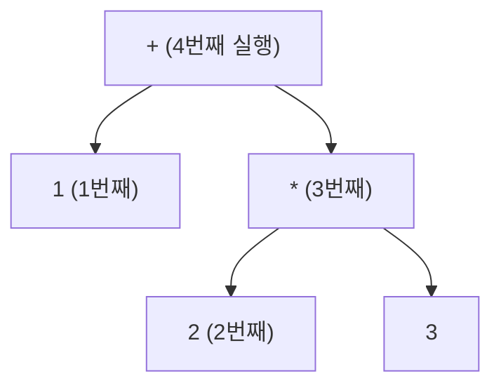

# 17. 문법과 액션

파서는 "문법에 맞는가"만 답하는 것이 아니다.
**축약할 때마다 액션이 실행되고**, 그 액션들이 실제 결과물을 만든다.

이 장에서는 액션으로 무엇을 할 수 있는지 —
계산, AST 구성, 심볼 테이블, 타입 검사, 코드 생성 —
을 `examples/08-mini-compiler` 로 끝까지 따라간다.

---

## 17.1 액션이 실행되는 시점

:::danger[액션은 그 규칙으로 **축약될 때** 실행된다]
우변의 심볼을 읽을 때가 아니다. **전부 읽고 나서** 실행된다.
:::

```c
expr : expr '+' expr    { printf("덧셈!\n"); $$ = $1 + $3; }
```

`1 + 2 + 3` 을 파싱하면 `덧셈!` 이 두 번 출력되는데,
그 시점은 각각 `1 + 2` 를 다 읽은 뒤, 그리고 `(1+2) + 3` 을 다 읽은 뒤다.

[15장의 LR 추적표](/docs/parsing/lr-parser-implementation#154-직접-실행해-보기)를
다시 보면, 액션은 `축약 r1` 이라 적힌 행에서 실행된다.

### 실행 순서 = 후위 순회

액션 실행 순서는 파스 트리의 **후위 순회(post-order)** 다.
자식이 모두 축약된 뒤에 부모가 축약되기 때문이다.



**이것이 상향식 파서로 코드를 생성하기 좋은 이유다.**
피연산자의 코드가 항상 먼저 나온다.

---

## 17.2 세 가지 액션 스타일

같은 파서로 세 가지 일을 할 수 있다.

### 스타일 ① 즉시 계산 — 인터프리터

값을 그 자리에서 계산한다.

```c title="examples/07-yacc-calc/calc.y"
expr : expr '+' expr    { $$ = $1 + $3; }
     | expr '*' expr    { $$ = $1 * $3; }
     | NUM              { $$ = $1; }
     ;
```

- 가장 간단하다
- 메모리를 거의 안 쓴다
- **한 번만 훑으므로 최적화가 불가능**하고, 전방 참조를 다룰 수 없다

계산기, 설정 파일 파서, 데이터 형식 리더에 적합하다.

### 스타일 ② 즉시 코드 생성 — 1-패스 컴파일러

축약할 때마다 목적 코드를 뱉는다.

```c
expr : expr '+' expr    { char *t = new_temp();
                          emit("%s = %s + %s", t, $1, $3);
                          $$ = t; }
     ;
```

- 메모리를 거의 안 쓴다 (초기 Pascal 컴파일러가 이 방식)
- 역시 **최적화가 불가능**하다

### 스타일 ③ AST 구성 — 다중 패스 컴파일러

트리를 만들고, 나중에 여러 번 순회한다.

```c title="examples/08-mini-compiler/mini.y"
expr : expr '+' expr    { $$ = node_binop("+", $1, $3, yylineno); }
     | expr '*' expr    { $$ = node_binop("*", $1, $3, yylineno); }
     | INT_LIT          { $$ = node_int($1, yylineno); }
     | ID               { $$ = node_var($1, yylineno); }
     ;
```

- 타입 검사, 최적화, 여러 백엔드가 가능해진다
- 오류 메시지에 문맥을 담기 쉽다
- **실제 컴파일러는 거의 전부 이 방식이다**

:::tip[액션은 짧게 유지하자]
액션 안에 긴 C 코드를 쓰면 문법이 읽히지 않는다.
**노드를 만드는 함수 하나만 호출**하고 나머지는 별도 파일에 두자.

`08-mini-compiler` 의 구성이 그 예다.
- `mini.y` — 문법과 `node_*()` 호출만
- `mini.c` — 심볼 테이블, 타입 검사, 코드 생성
- `mini.h` — 공용 선언
:::

---

## 17.3 AST 구성

### 노드 타입 설계

```c title="examples/08-mini-compiler/mini.h"
typedef enum {
    /* 식 */
    N_INT_LIT, N_FLOAT_LIT, N_VAR, N_BINOP, N_NEG, N_CONV,
    /* 문장 */
    N_ASSIGN, N_IF, N_WHILE, N_SEQ, N_PRINT, N_EMPTY
} NodeKind;

typedef struct Node {
    NodeKind kind;
    Type     type;        /* 의미 분석이 채운다 */
    int      line;

    long        ival;
    double      fval;
    char       *name;
    const char *op;

    struct Node *a, *b, *c;
} Node;
```

:::tip[`line` 을 모든 노드에 넣자]
나중에 오류 메시지를 낼 때 반드시 필요하다.
파싱이 끝난 뒤에는 소스 위치를 알 방법이 없으므로,
**만들 때 넣어 두지 않으면 되돌릴 수 없다**.
:::

### 문법에서 트리로

```c title="examples/08-mini-compiler/mini.y (발췌)"
%union {
    long    ival;
    double  fval;
    char   *name;
    Node   *node;
    int     type;
}

%type <node> stmt stmt_list block expr opt_else

%%

stmt
    : ID '=' expr ';'               { $$ = node_assign($1, $3, yylineno); }
    | KW_PRINT expr ';'             { $$ = node_print($2, yylineno); }
    | KW_IF '(' expr ')' stmt opt_else
                                    { $$ = node_if($3, $5, $6, yylineno); }
    | KW_WHILE '(' expr ')' stmt    { $$ = node_while($3, $5, yylineno); }
    | block                         { $$ = $1; }
    ;

stmt_list
    : /* 없음 */                    { $$ = NULL; }
    | stmt_list stmt                { $$ = node_seq($1, $2); }
    ;
```

`stmt_list` 가 **좌재귀**라는 점에 주목하자.
[16장에서 말한](/docs/yacc/yacc-overview#반복) 대로 LR에서는 이것이 옳다.

### 확인해 보기

```bash
cd examples/08-mini-compiler
make
printf 'int x;\nfloat y;\nx = 2 + 3 * 4;\ny = x / 2;\n' | ./minic -a
```

```
=== AST ===
  seq
    assign x
      + : int
        int 2
        * : int
          int 3
          int 4
    assign y
      (float)
        / : int
          var x : int
          int 2
```

`2 + 3 * 4` 에서 `*` 가 `+` 보다 **아래**에 있다.
우선순위 선언이 트리의 모양으로 나타난 것이다.

---

## 17.4 심볼 테이블

### 선언 처리의 난점

```c
int a, b, c;
```

타입은 맨 앞에 **한 번만** 나오는데,
LR은 상향식이라 `a`, `b`, `c` 를 축약할 때는 아직 타입을 모른다.

두 가지 해결책이 있다.

**방법 A — 이름을 모아 두었다가 나중에 등록**

```c title="examples/08-mini-compiler/mini.y"
static char *pending[MAXNAMES];
static int   npending;

decl
    : type id_list ';'              { pending_flush((Type)$1); }
    ;

id_list
    : ID                            { pending_add($1, yylineno); }
    | id_list ',' ID                { pending_add($3, yylineno); }
    ;
```

`type` 이 `id_list` **앞**에 있으므로 사실 `$1` 로 읽을 수도 있지만,
`id_list` 의 액션에서는 `$0` 을 써야 해서 위험하다.
전역 버퍼가 더 안전하고 읽기 쉽다.

**방법 B — 문법을 뒤집기**

```c
decl : id_list ':' type ';' ;    /* Pascal 스타일이면 자연스럽다 */
```

언어 설계 단계에서 정할 수 있다면 이쪽이 깔끔하다.

### 스코프

`08-mini-compiler` 는 스코프가 없다(전역 하나).
스코프를 넣으려면 블록 진입/이탈에서 테이블을 밀고 당겨야 한다.

```c
block : '{' { scope_push(); } stmt_list '}' { scope_pop(); $$ = $3; }
      ;
```

:::danger[중간 액션의 대가]
위 코드에는 중간 액션 `{ scope_push(); }` 가 있다.
[16장에서 경고한](/docs/yacc/yacc-overview#중간-액션) 대로

1. `stmt_list` 가 `$2` 가 아니라 **`$3`** 이 된다
2. 없던 충돌이 생길 수 있다

그래서 실무에서는 스코프 처리도 **AST 순회 단계로 미루는** 편이 많다.
파싱 중에는 트리만 만들고, 스코프는 나중에 트리를 돌면서 다룬다.
:::

---

## 17.5 타입 검사

파싱이 끝난 뒤 AST를 순회하며 타입을 채운다.

```c title="examples/08-mini-compiler/mini.c (발췌)"
static void check_expr(Node *n)
{
    switch (n->kind) {
    case N_VAR:
        n->type = sym_lookup(n->name);
        if (n->type == TY_ERROR)
            semantic_error(n->line, "선언되지 않은 변수 '%s'", n->name);
        break;

    case N_BINOP:
        check_expr(n->a);
        check_expr(n->b);
        /* 한쪽이 float 이면 양쪽을 float 으로 올린다 */
        if (n->a->type == TY_FLOAT || n->b->type == TY_FLOAT) {
            n->a = coerce(n->a, TY_FLOAT);
            n->b = coerce(n->b, TY_FLOAT);
            n->type = is_relational(n->op) ? TY_INT : TY_FLOAT;
        } else {
            n->type = TY_INT;
        }
        break;
    ...
    }
}
```

### 형 변환 노드 삽입

[1장에서 본](/docs/foundations/compiler-overview#-의미-분석-semantic-analysis)
`inttofloat` 삽입이 그대로 일어난다.

```c
static Node *coerce(Node *e, Type want)
{
    if (e->type == want || e->type == TY_ERROR) return e;
    if (e->type == TY_INT && want == TY_FLOAT) {
        Node *c = node_new(N_CONV, e->line);
        c->a = e;
        c->type = TY_FLOAT;
        return c;
    }
    return e;
}
```

**트리를 실제로 고친다.** 위 AST 덤프의 `(float)` 노드가 이렇게 생긴 것이다.

### 검사하는 것

```bash
./minic < tests/errors.in
```

```
3행: 'a' 는 이미 1행에서 선언되었다
6행: 선언되지 않은 변수 'c' 에 대입
7행: int 변수 'b' 에 float 값을 대입한다 (암묵적 축소는 허용하지 않는다)
8행: % 연산자는 int 에만 쓸 수 있다 (int % float)
```

:::info[이 넷은 전부 CFG로 표현할 수 없다]
[10장에서 설명한](/docs/parsing/context-free-grammar#cfg로도-안-되는-것) 그대로다.
"선언 후 사용", "타입이 맞아야 함"은 문맥 자유가 아니다.

그래서 파서가 아니라 **의미 분석 패스**가 잡는다.
이론적 한계가 컴파일러의 구조를 결정한 사례다.
:::

---

## 17.6 중간 코드 생성

AST를 다시 순회하며 3-주소 코드를 뱉는다.

### 식

```c
static const char *gen_expr(Node *n)
{
    switch (n->kind) {
    case N_INT_LIT:  return 상수 문자열;
    case N_VAR:      return n->name;

    case N_CONV: {
        const char *a = gen_expr(n->a);
        char *t = new_temp();
        emit("%s = inttofloat %s", t, a);
        return t;
    }

    case N_BINOP: {
        const char *a = gen_expr(n->a);
        char abuf[32];
        snprintf(abuf, sizeof abuf, "%s", a);   /* a 가 덮어써질 수 있다 */
        const char *b = gen_expr(n->b);
        char *t = new_temp();
        emit("%s = %s %s %s", t, abuf, n->op, b);
        return t;
    }
    }
}
```

각 `gen_expr` 은 코드를 뱉고 **결과가 담긴 주소**를 반환한다.
상수면 그 값, 변수면 이름, 계산 결과면 임시변수 이름이다.

### 제어 흐름

```c
case N_WHILE: {
    int l_top  = new_label();
    int l_exit = new_label();
    emit_label(l_top);
    const char *c = gen_expr(n->a);
    emit("ifFalse %s goto L%d", c, l_exit);
    gen(n->b);
    emit("goto L%d", l_top);
    emit_label(l_exit);
    break;
}
```

**조건 검사를 루프 위쪽에 둔다.** 실행할 때마다 조건을 다시 계산해야 하므로
`L_top` 이 조건 계산 **앞**에 있어야 한다.

### 전체 결과

```bash
./minic < tests/basic.in
```

```
=== 심볼 테이블 ===
  n            int    (2행 선언)
  i            int    (2행 선언)
  fact         int    (2행 선언)
  sum          float  (3행 선언)
  avg          float  (3행 선언)
=== 3-주소 코드 ===
  n = 5
  i = 1
  fact = 1
L1:
  t1 = i <= n
  ifFalse t1 goto L2
  t2 = fact * i
  fact = t2
  t3 = i + 1
  i = t3
  goto L1
L2:
  print fact
  t4 = inttofloat 0
  sum = t4
  ...
L4:
  t9 = inttofloat n
  t10 = sum / t9
  avg = t10
  print avg
```

`sum / n` 에서 `n` 이 int라 `inttofloat` 이 삽입되었다.
`sum` 은 이미 float이므로 그대로 쓰인다.

:::caution[숨은 함정 하나]
```
int x;  float y;
y = x / 2;
```
```
  t3 = x / 2          ← 정수 나눗셈!
  t4 = inttofloat t3
  y = t4
```

`x / 2` 는 **양쪽이 int이므로 정수 나눗셈**을 하고,
그 **결과**를 float으로 올린다. `x = 7` 이면 `y = 3.0` 이지 `3.5` 가 아니다.

C와 같은 의미론이고, 실무에서 아주 흔한 버그다.
타입 규칙을 명세에 정확히 적어 두는 것이 중요한 이유다.
:::

---

## 17.7 두 패스로 나눈 이유

`08-mini-compiler` 는 파싱 → 타입 검사 → 코드 생성 세 단계다.
한 번에 할 수도 있는데 왜 나눴을까?

**① 전방 참조**
파싱 중에는 뒤에 나올 선언을 모른다.
함수를 추가하면 상호 재귀 함수를 다룰 수 없게 된다.

**② 타입 정보가 코드 생성에 필요하다**
`a + b` 의 코드를 뽑으려면 정수 덧셈인지 실수 덧셈인지 알아야 한다.
그 정보는 양쪽 자식의 타입이 모두 정해진 뒤에야 확정된다.

**③ 최적화의 여지**
AST가 남아 있으면 상수 접기, 죽은 코드 제거 등을 넣을 수 있다.
한 번 뱉어 버린 코드는 되돌릴 수 없다.

**④ 오류 메시지**
"선언되지 않은 변수"를 파싱 중에 보고하면,
아직 파싱되지 않은 부분의 정보를 쓸 수 없다.

:::note[대가는 메모리다]
AST 전체를 들고 있어야 하므로 소스 크기에 비례하는 메모리를 쓴다.
1970년대에는 이것이 감당하기 어려웠고, 그래서 초기 Pascal 컴파일러가
1-패스로 설계되었다. Pascal이 "모든 것을 사용 전에 선언"하도록
규정한 이유이기도 하다.
:::

---

## 17.8 메모리 관리

액션에서 만든 노드와 문자열은 누가 해제할까?

### `strdup` 한 문자열

```c
{id}    { yylval.name = strdup(yytext); return ID; }
```

파서가 받아 AST 노드에 넣으면 노드가 소유한다.
**규칙이 실패하거나 값을 안 쓰면 샌다.**

```c
| ID '=' expr ';'   { $$ = node_assign($1, $3, yylineno); }   /* $1 을 노드가 소유 */
| error ';'         { $$ = NULL; yyerrok; }                   /* ← 여기서 샌다 */
```

### `%destructor`

bison이 오류 복구로 심볼을 버릴 때 호출할 정리 코드를 지정할 수 있다.

```c
%destructor { free($$); }        <name>
%destructor { node_free($$); }   <node>
```

:::tip[교육용 코드에서는 크게 신경 쓰지 않아도 된다]
컴파일러는 실행이 짧고 끝나면 OS가 전부 회수한다.
그래서 많은 컴파일러가 **일부러 해제하지 않는다** (arena 할당 후 통째로 버리기).

다만 **라이브러리로 쓰일 파서**나 **장시간 도는 서버**의 파서라면
반드시 처리해야 한다. `%destructor` 를 기억해 두자.
:::

---

## 17.9 실습

```bash
cd examples/08-mini-compiler
make && make test

./minic    < tests/basic.in      # 3-주소 코드
./minic -a < tests/ast.in        # AST 도 함께
./minic    < tests/errors.in     # 의미 오류
./minic    < tests/dangling.in   # dangling else
```

### 확장 과제

1. **`for` 문 추가** — 문법, AST 노드, 코드 생성 세 곳을 모두 고쳐야 한다.
2. **상수 접기** — AST를 순회하며 `2 + 3 * 4` 를 `14` 로 접어라.
   타입 검사와 코드 생성 사이에 패스를 하나 넣으면 된다.
3. **단축 평가** — `&&` 와 `||` 를 C처럼 단축 평가하게 만들어라.
   값 방식으로는 안 되고 **점프 코드**가 필요하다.
4. **스코프** — 블록마다 심볼 테이블을 밀고 당겨라.
   중간 액션 대신 AST 순회에서 처리하는 편을 권한다.
5. **가상 기계** — 3-주소 코드를 실제로 실행하는 인터프리터를 만들어라.

---

## 요약

- **액션은 축약될 때 실행된다.** 실행 순서는 파스 트리의 **후위 순회**이고,
  그래서 상향식 파서가 코드 생성에 유리하다.
- 액션 스타일 셋: **즉시 계산**(인터프리터), **즉시 코드 생성**(1-패스),
  **AST 구성**(다중 패스). 실제 컴파일러는 거의 전부 셋째다.
- **액션은 짧게.** 노드 생성 함수 하나만 호출하고 나머지는 별도 파일에.
- 모든 AST 노드에 **`line` 을 넣어 두자.** 나중에는 되돌릴 수 없다.
- 선언 `int a, b, c;` 는 타입이 앞에 한 번만 나오므로
  **이름을 모아 두었다가 나중에 등록**한다.
- **타입 검사는 AST를 순회하며** 하고, 필요하면 **형 변환 노드를 트리에 삽입**한다.
  이것이 1장의 `inttofloat` 삽입이다.
- 선언 검사·타입 검사는 **CFG로 표현할 수 없어서** 별도 패스가 필요하다.
- 패스를 나누는 이유: 전방 참조, 타입 정보 의존, 최적화 여지, 오류 메시지.
- `int / int` 는 정수 나눗셈을 한 뒤 변환된다. 흔한 버그.

## 확인 문제

1. `1 + 2 * 3` 을 파싱할 때 액션 실행 순서를 적어라.
2. `int a, b, c;` 에서 `a` 를 축약하는 시점에 타입을 알 수 없는 이유는?
   상향식/하향식 중 어느 쪽에서 더 문제인가?
3. `y = x / 2` (x는 int, y는 float)가 `3.5` 가 아니라 `3.0` 을 주는 이유를
   생성된 3-주소 코드로 설명하라.
4. `%destructor` 가 필요한 구체적 시나리오를 하나 들어라.
5. 상수 접기를 어느 단계에 넣어야 하는가? 파싱 액션에서 하면 왜 안 되는가?
6. `&&` 를 단축 평가로 만들려면 왜 값 방식으로 안 되는지 설명하라.

---

다음 장에서는 **충돌**을 다룬다.
`conflicts: 3 shift/reduce` 를 만났을 때 무엇을 해야 하는가.
